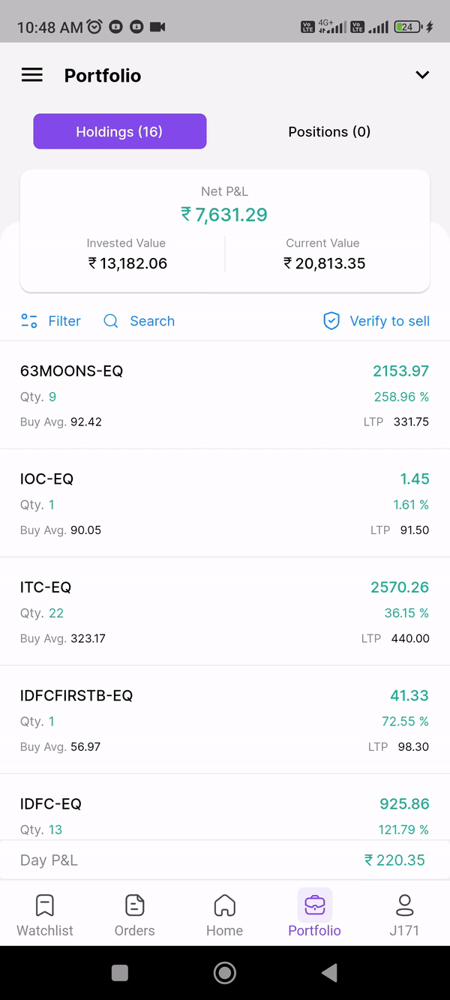
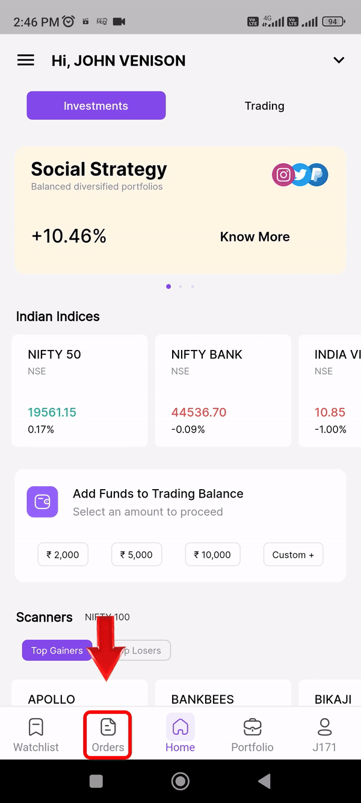
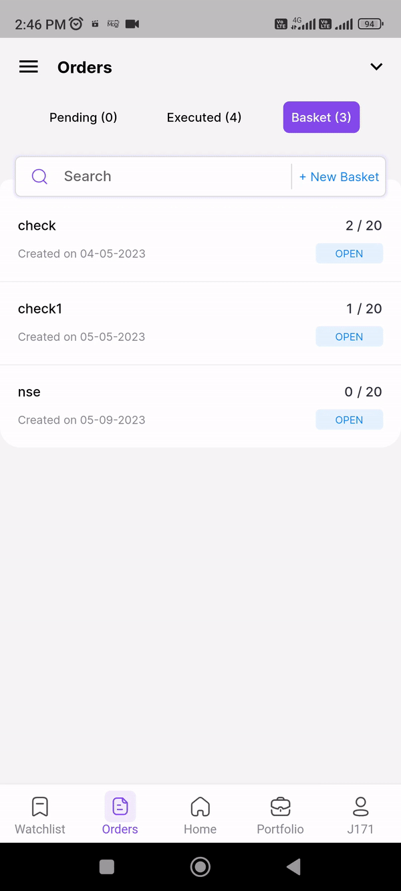
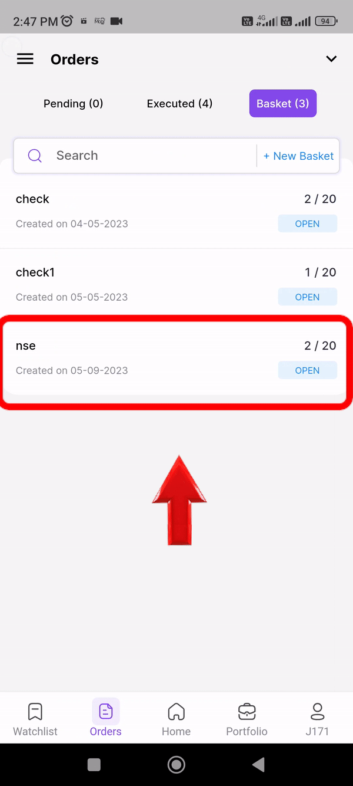

---

title: Orders

---

# Orders

### What is positional NRML

 NRML is a product code used for overnight trading of Futures & options and Currency. When you use the NRML product type, you do not get any excess leverage for trading. The trades with NRML code do not get auto-squared off unlike the Intraday orders.

### What is MIS:

 MIS stands for Margin Intraday Square-Off. MIS, as the name suggests, is a facility that can be used only for intraday trading. With MIS, you can trade across segments – cash, derivatives, index options and commodity futures.

### How to place an option chain order ?

#### Buy order

* Go to watchlist screen  then click the shares that you want to buy 
* Then hit buy tap , you will redirect to order page 
* Select the product type
* Positional NRML 
* Choose the type: Market 
* Variety: Regular
* Finally swipe to buy. You order will be executed 

{: style="max-width: 300px;""}

#### Sell order

  * Go to portfolio 
  * Select position tap on top right 
  * Then click which you want to sell
  * You will redirect to order page 
  * Select the product type
  * Select positional NRML or MIS
  * Choose the type: Limit
  * Variety: AMO
  * Place your sell order

  {: style="max-width: 300px;""}

The orders menu allows you to view the status of your pending orders, executed orders, and basket orders.

An AMO (After market Order) is a type of order which is placed by the investor when the market session is closed. This order gets placed on the exchange at the opening of the next market session.Note: Timing to place an AMO is between 5:00 pm and 9:00 am for NSE, NFO and Currency segments.

By clicking validity you can choose day order ioc validity order. 

An immediate or cancel order (IOC) is an order to buy or sell a security that attempts to execute all or part immediately and then cancels any unfilled portion of the order.

On the order page you can view our brokerage and transaction charges over here. 

### How to create a basket?

* Go to order page 
* Navigate to basket tap 
* Click new basket tap
* Type name for your basket 
* Finally click create button
* Your basket is added in CodiFi's mobile trading application

{: style="max-width: 300px;""}

### How to add orders in your basket?

 * Click on basket name which you have created
 * Then click add scripts in top right corner
 * Search for the stocks
 * Then hit add buy 
 * Change to your desired order setting 
 * Then swipe to add the stocks to your basket
 * You can add upto 20 stocks in a single basket 

  {: style="max-width: 300px;""}

### How to delete a basket?

* Click on basket name which you have created
* Long press the stocks that you have added in the basket
* You will see delete basket button in bottom of your app
* Then click on it to delete

  {: style="max-width: 300px;""}
