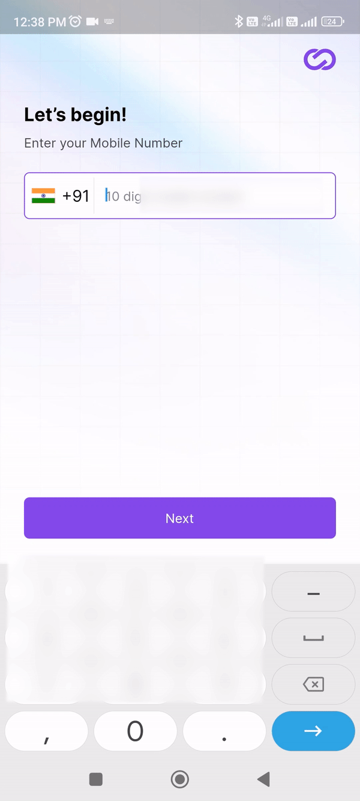
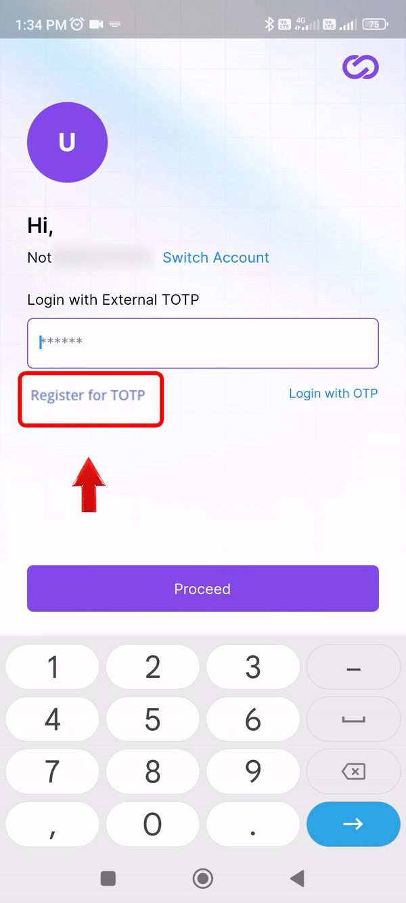
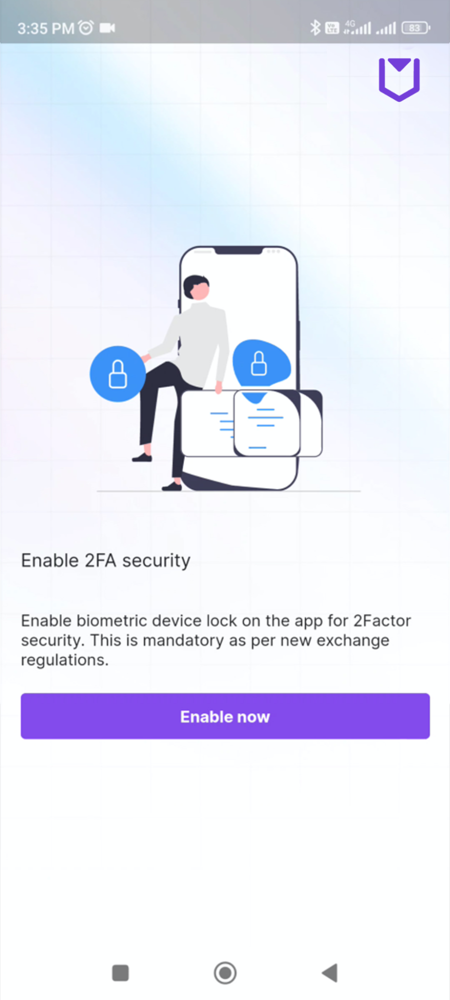
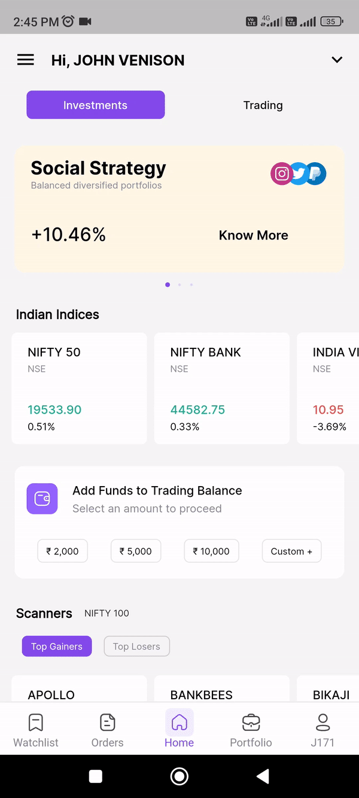
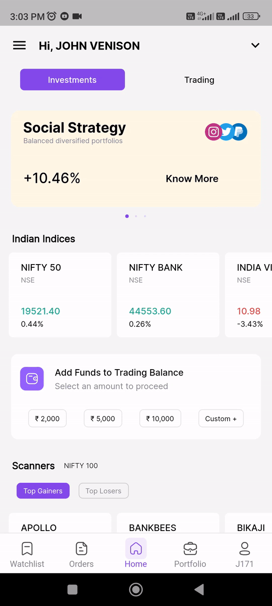
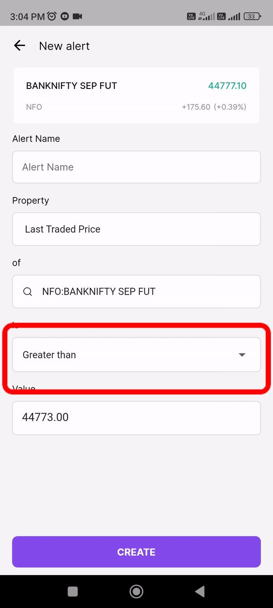
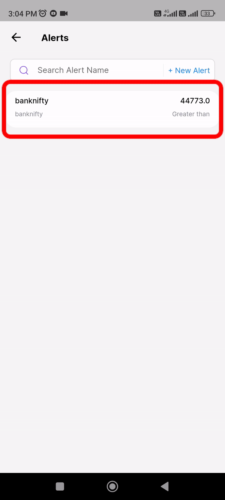

# Getting started

CodiFi's mobile trading application is a robust and user-friendly tool, offering a diverse set of features and advantages that deliver a cost-effective trading experience. It boasts minimal bandwidth usage, requiring less than 0.5Kbps for comprehensive market monitoring. Additionally, it provides effortless access to essential trading elements such as orders, positions, funds, and core trading functions. The app seamlessly integrates with the TradingView charting platform, offering over 100 indicators and more than 15 chart types for swift order execution and in-depth analysis.
 

## Login

To access the app, please adhere to the following procedure:

* Input your mobile number.
* Provide your password.
* Depending on your preferred setup, input either OTP or TOTP, which can be configured within your application.
* Click the "Proceed to Login" button.
* Activate biometric access as an additional layer of 2FA security.

{: style="max-width: 280px;""}

## TOTP

__TOTP authentication process:__

* To login into CodiFi's mobile trading application app with TOTP follow these few steps
* After providing your mobile number and password, click on "Register for TOTP."
* Enter the One-Time Password (OTP) sent to your registered mobile number.
* A QR code scan page will open
* Copy the secret key
* Download the "Google Authenticator" app. Install the app if you haven't already.
* Open the Google Authenticator app and click on the "+ icon" Enter a setup key".
* Enter your client code in account name tab, then paste your secret key and click add
* Your account will be added in Google authenticator displaying your client code.
* Enter the TOTP (Time-Based One-Time Password) generated by Google Authenticator into CodiFi's mobile trading application.
* Click "Next" in the CodiFi's mobile trading application.
* Enter the second TOTP to login to your account

{: style="max-width: 280px;""}

To enable biometric device lock/unlock, it is essential to click on the "Enable Now" button. This action is mandatory in accordance with the new exchange regulations, ensuring the implementation of two-factor security.

{: style="max-width: 300px;""}

**Welcome to the Mobile Application**

**Home page**

## Investment section

__How to Deposit Funds?__

* In the trading balance section, you can add funds by either choosing from predefined values like 5000 or 10000, or you have the option to customize the payment amount.
 
* Select your preferred payment method to proceed with the payment.

### Exchange Traded Funds (ETFs)

An ETF, short for exchange-traded fund, is a tradable security that mirrors the performance of an index, commodity, bonds, or a collection of assets, much like an index fund. In simpler terms, ETFs are investment funds that track indexes such as CNX Nifty or BSE Sensex, among others.

### SGB Section

SGBs are government securities denominated in grams of gold. They are substitutes for holding physical gold. Investors have to pay the issue price in cash and the bonds will be redeemed in cash on maturity.

### IPO Section:

__Initial Public Offerings (IPOs):__

An initial public offering (IPO) refers to the process of introducing shares of a privately-held company to the general public for the first time through a new stock offering. An IPO enables a company to raise equity capital from public investors.

## Trading page section

### How to Navigate the Option Chain?

To access the option chain, start from the homepage and select the trading section. In the top left corner, locate the option chain. Then, in the upper right corner, click the search icon to choose the specific option chain you wish to trade for buying and selling.

{: style="max-width: 300px;""}

### How to Utilize the Alert Tab?

To make use of the alert tab, begin on the homepage and select the trading section. Proceed to the Alerts tab in the top right. Click on the alert tab and then select the third tab with the search icon. Type in your preferred trade name (e.g., Nifty 50, Banknifty, Nifty Bees, Nifty 100), and select it.

{: style="max-width: 300px;""}

### Nifty Bees, Nifty 100, and select it.

The strike price for your chosen trade is automatically populated into the alerts. Set the strike price to be less than or equal to (or) greater than or equal to the value, depending on your preference for setting the alert. At the top section, there's an alert name tab where you can type a name for your reminder. Finally, click "Create" to set up the alert.

{: style="max-width: 300px;""}

### How to Modify Your Alerts?

If you wish to edit an alert that you've previously created, select the alert you want to modify and click on the "Edit" option. Make the necessary changes to your alert fields, and then click "Save" to apply the modifications.

{: style="max-width: 300px;""}

