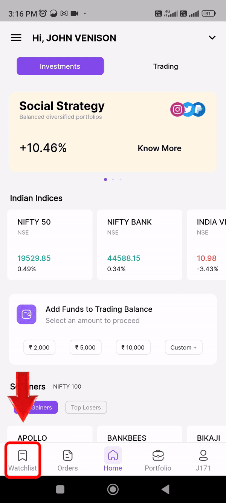
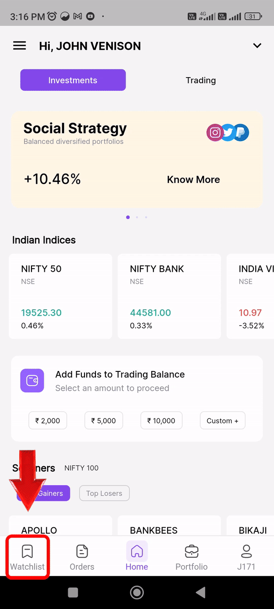
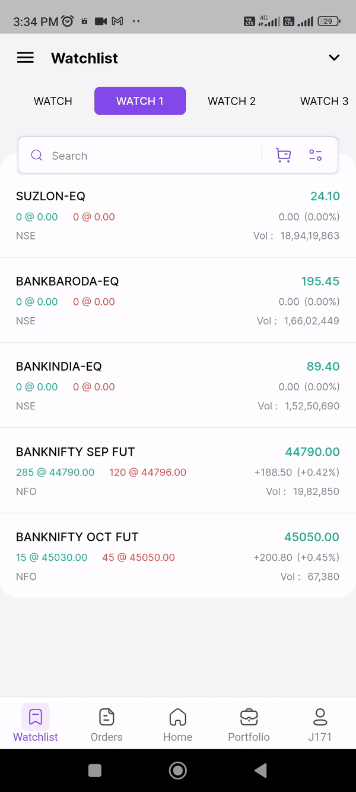

### How to add stocks in Watch list

In the watchlist section you can add your preferred watchlist shares

Go to add scripts and search for your preferred shares just click the plus icon in the right corner and your script will be added to your watchlist.

{: style="max-width: 300px;""}

###  Adding multiple shares in watchlist

Promptly to add multiple shares on the watchlist screen.

{: style="max-width: 300px;""}

## Customize watchlist

__View:__

* You can customize your watchlist by selecting the sort icon in the search tap of your watchlist. 
* By selecting grid shares in your watchlist will be displayed like grid view.
* You can add simple in the top or bottom by clicking top icon or bottom icon.
* Content of your watchlist can be customized by selecting basic or depth or all buttons, for your comfort.

{: style="max-width: 300px;""}

## Sort

* In your watchlist you can sort your share by A-Z or Z-A order
* % -Change in upward direction or downward direction
* LTP- Last Trade Price 
* By exchange (NSE, BSE, MCX, NFO)

## Filter

**Filter your watchlist shares by NSE, NFO and Holdings.** 

You can create up to 5 watchlists for BSE,NSE, NFO and MCX Separately for your convenience to trade better.
